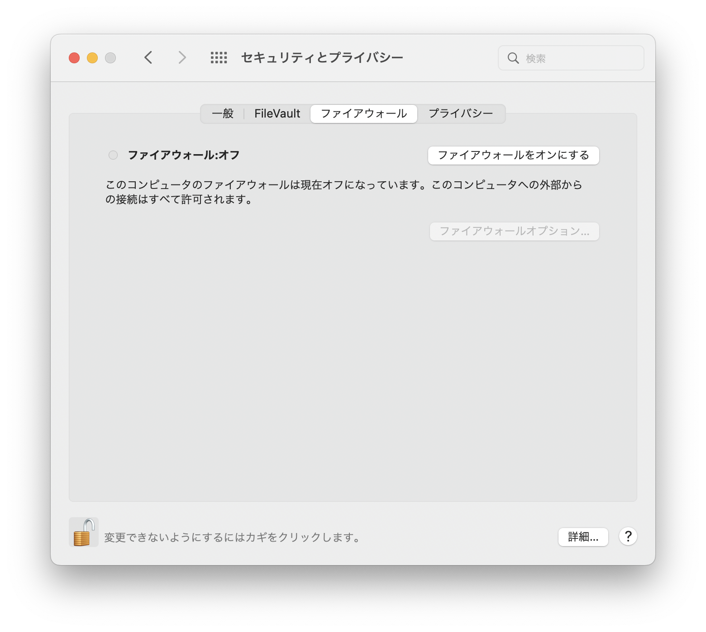
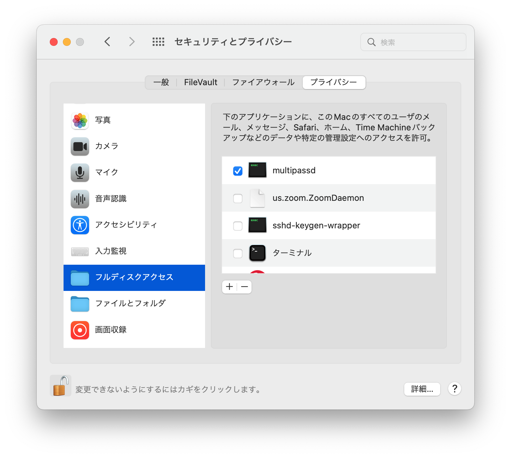

# mac向けマニュアル

## 0. 準備

### Homebrewのインストール
`brew`コマンドが使えない場合は下記の手順を行なって下さい。
```zsh
/bin/bash -c "$(curl -fsSL https://raw.githubusercontent.com/Homebrew/install/HEAD/install.sh)"
```

## ローカル環境の構築
ローカル環境に必要なソフトウェアを一括インストールします。`mac/brew/basic.sh`を実行することで次のアプリケーションのインストールが可能です。
```
bash ./basic.sh
```
```
google-chrome
discord
git
gh
visual-studio-code
multipass
iterm2
```
## VS Code Extensionのインストール
vscodeに推奨される拡張機能を一括インストールします。各自で拡張機能リストのファイルを作成することでカスタムインストールも可能です。`mac/vscode-extension/basic.sh`を実行することで次の拡張機能のインストールが可能です。`cpp.sh`や`rust.sh`を実行した場合、各言語のExtensionも`basic.sh`に加えて追加されます。
```
bash ./basic.sh
```
```
vscode-icons-team.vscode-icons
yzhang.markdown-all-in-one
mosapride.zenkaku
oderwat.indent-rainbow
VisualStudioExptTeam.vscodeintellicode
ms-vsliveshare.vsliveshare
ms-vscode-remote.remote-ssh
ms-vscode-remote.remote-ssh-edit
ms-vscode.powershell
timonwong.shellcheck
streetsidesoftware.code-spell-checker
foxundermoon.shell-format
mhutchie.git-graph
hediet.vscode-drawio
janisdd.vscode-edit-csv
Gruntfuggly.todo-tree
jebbs.plantuml
```

## 仮想環境の構築

### 1. multipassインスタンスアクセスの有効化
macのファイアウォールが有効化されていると、multipassインスタンスを起動できない問題があるため、ファイアウォールの無効化を行います。インスタンス起動後はオンに戻してもOKです。

1. ディスクトップ画面左上の🍎アイコンをクリック
2. "システム環境設定"をクリック
3. "セキュリティとプライバシー"をクリック
4. "ファイアウォール"タブを選択
5. 左下の南京錠アイコンをクリックして、パスワードを入力。
6. 下記画像のように設定されていればOK


### 2. multipassへのフルディスクアクセスの有効化
osからmultipassへディレクトリのマウントを許可するため、下記の手順を行なって下さい。

1. ディスクトップ画面左上の🍎アイコンをクリック
2. "システム環境設定"をクリック
3. "セキュリティとプライバシー"をクリック
4. "プライバシー"タブを選択
5. 左の一覧から"フルディスクアクセス"を選択
6. 左下の南京錠をクリックして、パスワード入力
7. 右の一覧の"multipassd"にチェック
8. 下記画像のように設定されていればOK


### 3. 仮想環境構築スクリプトの実行
multipassによりubuntu仮想環境を構築します。
`mac/multipass`ディレクトリ下の各スクリプト`cpp.sh` / `cs.sh` / `nodejs.sh` / `rust.sh` / `docker.sh` / `python.sh`を実行することでc++ / cs / nodejs / rust / docker / pythonの仮想環境をそれぞれ構築できます。
```sh
bash ./cpp.sh
```
```sh
bash ./cs.sh
```
```sh
bash ./nodejs.sh
```
```sh
bash ./rust.sh
```
```sh
bash ./docker.sh
```
```sh
bash ./python.sh
```
また、上記のスクリプトを利用する場合、`workspace`下のmultipassインスタンス名に対応するディレクトリがマウントされるように動作します。
任意のディレクトリをマウントしたい・リソース割り振りを変更したい場合は上記バッチの代わりに各環境に対する下記のコマンドを`windows/multipass` ディレクトリ下で実行してください。(リソースのデフォルト値は`cpu: 2`, `disksize: 24[GByte]`, `memory: 4[GByte]`)
- c++環境
    ```sh
    bash ./launch.sh cpp 2 24G 4G ../../config/multipass/cpp/cpp.yaml 22.04 <マウント対象ディレクトリへののフルパス> /home/ubuntu/synced-cpp
    ```
- cs環境(x64のみ)
    ```sh
    bash ./launch.sh cs 2 24G 4G ../../config/multipass/cs/cs.yaml 22.04 <マウント対象ディレクトリへのフルパス> /home/ubuntu/synced-cs
    ```
- nodejs環境
    ```sh
    bash ./launch.sh nodejs 2 24G 4G ../../config/multipass/nodejs/nodejs.yaml 22.04 <マウント対象ディレクトリへのフルパス> /home/ubuntu/synced-nodejs
    ```
- rust環境
    ```sh
    bash ./launch.sh rust 2 24G 4G ../../config/multipass/rust/rust.yaml 22.04 <マウント対象ディレクトリへのフルパス> /home/ubuntu/synced-rust
    ```
- docker環境
    ```sh
    bash ./launch.sh docker 2 40G 4G ../../config/multipass/docker/docker.yaml 22.04 <マウント対象ディレクトリへのフルパス> /home/ubuntu/synced-docker
    multipass exec docker -- mkdir /home/ubuntu/init
    multipass transfer ../../config/multipass/docker/install-docker.sh docker:/home/ubuntu/init/
    ```
- python環境
    ```sh
    bash ./launch.sh python 2 24G 4G ../../config/multipass/python/python.yaml 22.04 <マウント対象ディレクトリへのフルパス> /home/ubuntu/synced-python
    multipass exec python -- mkdir /home/ubuntu/init
    multipass transfer ../../config/multipass/python/install-pyenv.sh python:/home/ubuntu/init/
    multipass transfer ../../config/multipass/python/install-python.sh python:/home/ubuntu/init/
    ```
