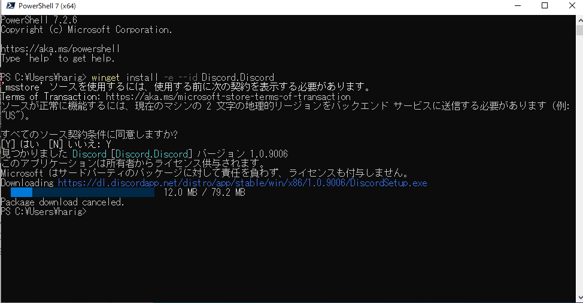
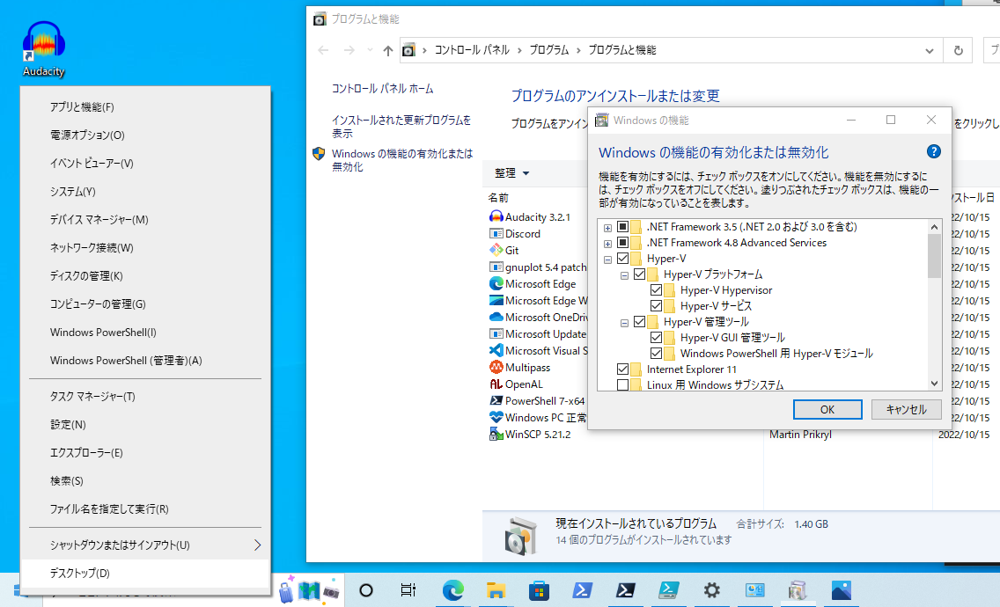

# windows向けマニュアル

## 0. 準備
### 1. パッケージマネージャ（winget）のインストール
1. スタートメニューの"Microsoft Store"のアイコンをクリック
2. 検索欄に"アプリインストーラ"と入力して検索
3. 検索結果の一覧から"アプリインストーラを選択"
4. インストールのボタンがあればそれをクリックしてインストール（ボタンなければ既にインストール済み）


### 2. powershell7のインストール
システムのpowershellは新しいpowershellを利用することを推奨しているため（powershell7が既にインストールされている場合にはこの作業は不要）

システム内蔵のpowershellを起動し、次のコマンドを実行してください。
```powershell
winget install --id Microsoft.Powershell --source winget
```
### 3. msstoreの承認
wingetでmsstoreからアプリケーションをインストールするには認証が必要です。


1. 下記コマンドをpowershell7上で実行
    ```powershell
    winget install -e --id Discord.Discord
    ``` 
2. "すべてのソーズ条件に同意しますか？"と聞かれるので`Y`を入力
3. 既にDiscordがインストールされている状態であれば、`ctrl + C`でインストールをキャンセル
### 4. Hyper-vの有効化
次の条件のいずれかを満たしている場合この作業は必要ありません。
Pro版の場合は下記の`Enable-WindowsOptionalFeature`コマンドでHyper-vの有効化を行なってください。

- multipassによる仮想環境の構築が不要
- Virtual Boxが既にインストール済み
　
1. `windows/multipass/enable-hyper-v.bat`を管理者権限で実行（この作業を行うとOSが再起動するため、`enable-hyper-v.bat`の実行前に他のアプリケーションを終了しておく）
2. Hyper-vの有効化を次の手順で確認

    1. スタートを右クリック
    2. "アプリと機能"をクリック
    3. "プログラムと機能"を選択
    4. "Windowsの機能の有効化または無効化"をクリック
    5. "Hyper-V Hypervisor"にレ点が入っていることを確認

- Pro版は管理者権限で実行したpowershellで下記コマンドを実行
  ```poweshell
  PS C:\Windows\System32> Enable-WindowsOptionalFeature -Online -FeatureName Microsoft-Hyper-V -All
  ```
## ローカル環境の構築
ローカル環境に必要なソフトウェアを一括インストールします。各自でソフトウェアのリストのファイルを作成することでカスタムインストールも可能です。`windows/winget/basic.bat`を実行することで次のアプリケーションのインストールが可能です。
```
Google.Chrome
Discord.Discord
WinSCP.WinSCP
Git.Git
GitHub.cli
Microsoft.VisualStudioCode
Canonical.Multipass
```
## VS Code Extensionのインストール
vscodeに推奨される拡張機能を一括インストールします。各自で拡張機能リストのファイルを作成することでカスタムインストールも可能です。`windows/vscode-extension/basic.bat`を実行することで次の拡張機能のインストールが可能です。`cpp.bat`や`rust.bat`を実行した場合、各言語のExtensionも`basic.bat`に加えて追加されます。
```
vscode-icons-team.vscode-icons
yzhang.markdown-all-in-one
mosapride.zenkaku
oderwat.indent-rainbow
VisualStudioExptTeam.vscodeintellicode
ms-vsliveshare.vsliveshare
ms-vscode-remote.remote-ssh
ms-vscode-remote.remote-ssh-edit
ms-vscode.powershell
timonwong.shellcheck
streetsidesoftware.code-spell-checker
foxundermoon.shell-format
mhutchie.git-graph
hediet.vscode-drawio
janisdd.vscode-edit-csv
Gruntfuggly.todo-tree
jebbs.plantuml
```


## 仮想環境の構築
multipassによりubuntu仮想環境を構築します。
各バッチ`cpp.bat` / `cs.bat` / `nodejs.bat` / `rust.bat` / `docker.bat` / `python.bat`を管理者として開いたpowershellからコマンド実行することでc++ / cs / nodejs / rust / docker / pythonの仮想環境を構築できます。
```powershell
./cpp.bat
```
```powershell
./cs.bat
```
```powershell
./nodejs.bat
```
```powershell
./rust.bat
```
```powershell
./docker.bat
```
```powershell
./python.bat
```
また、上記のバッチを利用する場合、`workspace`下のmultipassインスタンス名に対応するディレクトリがマウントされるように動作します。
任意のディレクトリをマウントしたい・リソース割り振りを変更したい場合は上記バッチの代わりに各環境に対する下記のコマンドを`windows/multipass` ディレクトリ下で実行してください。(リソースのデフォルト値は`cpu: 2`, `disksize: 24[GByte]`, `memory: 4[GByte]`)
- c++環境
    ```powershell
    pwsh -ExecutionPolicy Bypass ./launch.ps1 cpp 2 24G 4G ../../config/multipass/cpp/cpp.yaml 22.04 <マウント対象フォルダへののフルパス> /home/ubuntu/synced-cpp
    ```
- cs環境(x64のみ)
    ```powershell
    pwsh -ExecutionPolicy Bypass ./launch.ps1 cs 2 24G 4G ../../config/multipass/cs/cs.yaml 22.04 <マウント対象フォルダへのフルパス> /home/ubuntu/synced-cs
    ```
- nodejs環境
    ```powershell
    pwsh -ExecutionPolicy Bypass ./launch.ps1 nodejs 2 24G 4G ../../config/multipass/nodejs/nodejs.yaml 22.04 <マウント対象フォルダへのフルパス> /home/ubuntu/synced-nodejs
    ```
- rust環境
    ```powershell
    pwsh -ExecutionPolicy Bypass ./launch.ps1 rust 2 24G 4G ../../config/multipass/rust/rust.yaml 22.04 <マウント対象フォルダへのフルパス> /home/ubuntu/synced-rust

    ```
- docker環境
    ```powershell
    pwsh -ExecutionPolicy Bypass ./launch.ps1 docker 2 24G 4G ../../config/multipass/docker/docker.yaml 22.04 <マウント対象フォルダへのフルパス> /home/ubuntu/synced-docker
    multipass exec docker -- mkdir /home/ubuntu/init
    multipass transfer (Convert-Path ../../config/multipass/docker)/install-docker.sh docker:/home/ubuntu/init/
    ```
- python環境
    ```powershell
    pwsh -ExecutionPolicy Bypass ./launch.ps1 python 2 24G 4G ../../config/multipass/python/python.yaml 22.04 <マウント対象フォルダへのフルパス> /home/ubuntu/synced-python
    multipass exec python -- mkdir /home/ubuntu/init
    multipass transfer (Convert-Path ../../config/multipass/python)/install-pyenv.sh python:/home/ubuntu/init/
    multipass transfer (Convert-Path ../../config/multipass/python)/install-python.sh python:/home/ubuntu/init/
    ```